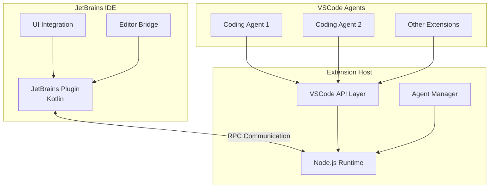

# Contributing Guide

[](https://opensource.org/licenses/Apache-2.0)
[](https://nodejs.org/)
[](https://www.jetbrains.com/)

> **Welcome to contribute to the RunVSAgent project!**

Thank you for your interest in contributing to RunVSAgent! RunVSAgent is an innovative cross-platform development tool that enables developers to run VSCode-based coding agents and extensions within JetBrains IDEs. Your contributions help us build a better development experience for the community.

## 🎯 Project Overview

RunVSAgent bridges the gap between VSCode extensions and JetBrains IDEs through:
- **Cross-platform compatibility**: Run VSCode agents in IntelliJ IDEA, WebStorm, PyCharm, and other JetBrains IDEs
- **Seamless integration**: Native IDE experience with VSCode extension capabilities
- **High-performance communication**: RPC-based architecture for real-time interaction
- **Extensible design**: Plugin architecture supporting various coding agents

## 🤝 Types of Contributions

We welcome various types of contributions:

- **🐛 Bug Reports**: Help us identify and fix issues
- **✨ Feature Requests**: Suggest new features and improvements
- **💻 Code Contributions**: Implement features, fix bugs, improve performance
- **📚 Documentation**: Improve guides, API docs, and examples
- **🧪 Testing**: Write tests, improve test coverage, test new features
- **🎨 UI/UX**: Enhance user interface and experience
- **🌐 Localization**: Translate the project to different languages
- **📝 Code Reviews**: Review pull requests and provide feedback

## 🛠️ Development Environment Setup

### Prerequisites

Before you begin, ensure you have the following installed:

- **Node.js**: Version 18.0.0 or later
- **npm**: Version 8.0.0 or later (comes with Node.js)
- **Git**: Any recent version
- **JDK**: Version 17 or later (for JetBrains plugin development)
- **JetBrains IDE**: IntelliJ IDEA 2023.1+ (for testing)

### Optional Tools

- **pnpm**: Alternative package manager (recommended for faster installs)
- **shellcheck**: For shell script linting
- **Gradle**: Will be downloaded automatically by the wrapper

### Initial Setup

1. **Fork and Clone the Repository**

```bash
# Fork the repository on GitHub, then clone your fork
git clone https://github.com/YOUR_USERNAME/RunVSAgent.git
cd RunVSAgent

# Add the original repository as upstream
git remote add upstream https://github.com/original-org/RunVSAgent.git
```

2. **Initialize Development Environment**

```bash
# Run the setup script to initialize everything
./scripts/setup.sh

# For verbose output (recommended for first-time setup)
./scripts/setup.sh --verbose
```

3. **Verify Installation**

```bash
# Build the project to ensure everything is working
./scripts/build.sh

# Run tests
./scripts/test.sh
```

### Development Mode

For active development, you can run components in development mode:

```bash
# Start extension host in development mode
cd extension_host
npm run dev

# In another terminal, run JetBrains plugin in development mode
cd jetbrains_plugin
./gradlew runIde
```

### IDE Configuration

#### IntelliJ IDEA Setup

1. Open the project root directory in IntelliJ IDEA
2. Import the Gradle project from `jetbrains_plugin/`
3. Configure JDK 17+ in Project Settings
4. Install recommended plugins:
   - Kotlin
   - Gradle
   - Git

#### VSCode Setup (Optional)

For TypeScript development:

1. Open the `extension_host/` directory in VSCode
2. Install recommended extensions (see `.vscode/extensions.json`)
3. Use the provided debug configurations

## 🔄 Code Contribution Workflow

### Branch Strategy

We use a Git Flow-inspired branching strategy:

- **`main`**: Production-ready code
- **`develop`**: Integration branch for features
- **`feature/*`**: Feature development branches
- **`bugfix/*`**: Bug fix branches
- **`hotfix/*`**: Critical fixes for production
- **`release/*`**: Release preparation branches

### Branch Naming Convention

```
feature/add-new-agent-support
bugfix/fix-rpc-connection-issue
hotfix/critical-security-patch
release/v1.2.0
docs/update-contributing-guide
test/improve-unit-test-coverage
```

### Step-by-Step Contribution Process

1. **Create a Feature Branch**

```bash
# Sync with upstream
git fetch upstream
git checkout main
git merge upstream/main

# Create and switch to a new branch
git checkout -b feature/your-feature-name
```

2. **Make Your Changes**

- Write clean, well-documented code
- Follow the coding standards (see below)
- Add tests for new functionality
- Update documentation as needed

3. **Test Your Changes**

```bash
# Run all tests
./scripts/test.sh

# Run specific test types
./scripts/test.sh unit
./scripts/test.sh lint
./scripts/test.sh integration

# Build the project
./scripts/build.sh --mode debug
```

4. **Commit Your Changes**

Follow the conventional commit format:

```bash
git add .
git commit -m "feat: add support for new VSCode agent API"
```

5. **Push and Create Pull Request**

```bash
git push origin feature/your-feature-name
```

Then create a pull request on GitHub with:
- Clear title and description
- Reference to related issues
- Screenshots/demos if applicable
- Checklist completion

### Commit Message Format

We follow the [Conventional Commits](https://www.conventionalcommits.org/) specification:

```
<type>[optional scope]: <description>

[optional body]

[optional footer(s)]
```

**Types:**
- `feat`: New feature
- `fix`: Bug fix
- `docs`: Documentation changes
- `style`: Code style changes (formatting, etc.)
- `refactor`: Code refactoring
- `test`: Adding or updating tests
- `chore`: Maintenance tasks
- `perf`: Performance improvements
- `ci`: CI/CD changes

**Examples:**
```
feat(extension-host): add support for WebView API
fix(jetbrains-plugin): resolve RPC connection timeout issue
docs: update installation guide for Windows users
test(rpc): add unit tests for message serialization
```

## 📋 Code Standards and Quality

### TypeScript Code Standards

#### Style Guidelines

- Use **TypeScript 5.0+** features
- Follow **ESLint** and **Prettier** configurations
- Use **camelCase** for variables and functions
- Use **PascalCase** for classes and interfaces
- Use **UPPER_SNAKE_CASE** for constants

#### Code Examples

```typescript
// ✅ Good
interface ExtensionConfig {
  readonly name: string;
  readonly version: string;
  readonly enabled: boolean;
}

class ExtensionManager {
  private readonly extensions = new Map<string, Extension>();
  
  public async loadExtension(config: ExtensionConfig): Promise<void> {
    // Implementation
  }
}

// ❌ Bad
interface extensionconfig {
  name: string;
  version: string;
  enabled: boolean;
}

class extension_manager {
  extensions = {};
  
  loadExtension(config) {
    // Implementation
  }
}
```

#### Error Handling

```typescript
// ✅ Good - Proper error handling
async function loadExtension(path: string): Promise<Extension> {
  try {
    const config = await readExtensionConfig(path);
    return new Extension(config);
  } catch (error) {
    logger.error(`Failed to load extension from ${path}:`, error);
    throw new ExtensionLoadError(`Cannot load extension: ${error.message}`);
  }
}

// ❌ Bad - Silent failures
async function loadExtension(path: string): Promise<Extension | null> {
  try {
    const config = await readExtensionConfig(path);
    return new Extension(config);
  } catch (error) {
    return null; // Silent failure
  }
}
```

### Kotlin Code Standards

#### Style Guidelines

- Follow **Kotlin Coding Conventions**
- Use **ktlint** for formatting
- Use **camelCase** for functions and properties
- Use **PascalCase** for classes
- Use **UPPER_SNAKE_CASE** for constants

#### Code Examples

```kotlin
// ✅ Good
class ExtensionHostManager(
    private val project: Project,
    private val logger: Logger
) {
    companion object {
        private const val DEFAULT_TIMEOUT = 5000L
        private const val MAX_RETRY_COUNT = 3
    }
    
    suspend fun startExtensionHost(): Result<ExtensionHost> {
        return try {
            val host = createExtensionHost()
            host.start()
            Result.success(host)
        } catch (e: Exception) {
            logger.error("Failed to start extension host", e)
            Result.failure(e)
        }
    }
}

// ❌ Bad
class extensionhostmanager(project: Project, logger: Logger) {
    fun startExtensionHost(): ExtensionHost? {
        try {
            val host = createExtensionHost()
            host.start()
            return host
        } catch (e: Exception) {
            return null
        }
    }
}
```

#### Coroutines Usage

```kotlin
// ✅ Good - Proper coroutine usage
class RpcManager(private val scope: CoroutineScope) {
    suspend fun sendMessage(message: RpcMessage): RpcResponse {
        return withContext(Dispatchers.IO) {
            withTimeout(5000) {
                rpcChannel.send(message)
            }
        }
    }
}

// ❌ Bad - Blocking operations
class RpcManager {
    fun sendMessage(message: RpcMessage): RpcResponse {
        return runBlocking {
            rpcChannel.send(message) // Blocks the thread
        }
    }
}
```

### Code Formatting

#### Automated Formatting

```bash
# Format TypeScript code
cd extension_host
npm run format

# Format Kotlin code
cd jetbrains_plugin
./gradlew ktlintFormat

# Check formatting
./scripts/test.sh lint
```

#### Editor Configuration

Use the provided `.editorconfig` file:

```ini
root = true

[*]
charset = utf-8
end_of_line = lf
insert_final_newline = true
trim_trailing_whitespace = true

[*.{ts,js}]
indent_style = space
indent_size = 2

[*.kt]
indent_style = space
indent_size = 4

[*.md]
trim_trailing_whitespace = false
```

### Documentation Standards

#### Code Comments

```typescript
/**
 * Manages the lifecycle of VSCode extensions within the JetBrains environment.
 * 
 * This class handles:
 * - Extension loading and unloading
 * - Communication with the extension host
 * - Error handling and recovery
 * 
 * @example
 * ```typescript
 * const manager = new ExtensionManager(config);
 * await manager.loadExtension('path/to/extension');
 * ```
 */
class ExtensionManager {
    /**
     * Loads an extension from the specified path.
     * 
     * @param extensionPath - Absolute path to the extension directory
     * @returns Promise that resolves to the loaded extension
     * @throws ExtensionLoadError if the extension cannot be loaded
     */
    async loadExtension(extensionPath: string): Promise<Extension> {
        // Implementation
    }
}
```

#### README and Documentation

- Use clear, concise language
- Include code examples
- Provide step-by-step instructions
- Add diagrams for complex concepts
- Keep documentation up-to-date with code changes

## 🏗️ Project Architecture Guide

### High-Level Architecture



### Core Components

#### 1. JetBrains Plugin (`jetbrains_plugin/`)

**Purpose**: Integrates with JetBrains IDEs and provides the bridge to VSCode extensions.

**Key Modules**:
- **Core** (`core/`): Main plugin logic, extension host management
- **Actions** (`actions/`): IDE actions and commands
- **Actors** (`actors/`): RPC communication handlers
- **Editor** (`editor/`): Editor integration and document management
- **UI** (`ui/`): User interface components
- **WebView** (`webview/`): WebView support for extensions

**Architecture Patterns**:
- **Actor Model**: For RPC communication
- **Observer Pattern**: For event handling
- **Factory Pattern**: For component creation

#### 2. Extension Host (`extension_host/`)

**Purpose**: Provides VSCode API compatibility layer and manages extension lifecycle.

**Key Modules**:
- **Main** (`main.ts`): Entry point and initialization
- **Extension Manager** (`extensionManager.ts`): Extension lifecycle management
- **RPC Manager** (`rpcManager.ts`): Communication with JetBrains plugin
- **WebView Manager** (`webViewManager.ts`): WebView support

**Architecture Patterns**:
- **Module Pattern**: For code organization
- **Event-Driven Architecture**: For extension communication
- **Proxy Pattern**: For API compatibility

### Communication Protocol

#### RPC Message Format

```typescript
interface RpcMessage {
  id: string;
  method: string;
  params: unknown[];
  timestamp: number;
}

interface RpcResponse {
  id: string;
  result?: unknown;
  error?: RpcError;
  timestamp: number;
}
```

#### Communication Flow

1. **JetBrains Plugin** → **Extension Host**: Command execution
2. **Extension Host** → **VSCode Extension**: API calls
3. **VSCode Extension** → **Extension Host**: Responses/Events
4. **Extension Host** → **JetBrains Plugin**: Results/Notifications

### Extension Points

#### Adding New VSCode API Support

1. **Define the API interface** in `extension_host/src/api/`
2. **Implement the API handler** in the extension host
3. **Add RPC communication** between plugin and host
4. **Create corresponding actor** in the JetBrains plugin
5. **Add tests** for the new functionality

#### Creating New Agent Types

1. **Extend the base agent interface**
2. **Implement agent-specific logic**
3. **Add configuration options**
4. **Update documentation**

### Development Guidelines

#### Adding New Features

1. **Design Phase**:
   - Create design document
   - Review with maintainers
   - Consider backward compatibility

2. **Implementation Phase**:
   - Follow TDD approach
   - Implement in small, reviewable chunks
   - Add comprehensive tests

3. **Integration Phase**:
   - Test with real extensions
   - Performance testing
   - Documentation updates

#### Performance Considerations

- **Minimize RPC calls**: Batch operations when possible
- **Use async/await**: Avoid blocking operations
- **Memory management**: Dispose resources properly
- **Lazy loading**: Load extensions on demand

## 🧪 Testing Guide

### Testing Strategy

We use a multi-layered testing approach:

1. **Unit Tests**: Test individual components in isolation
2. **Integration Tests**: Test component interactions
3. **End-to-End Tests**: Test complete user workflows
4. **Performance Tests**: Ensure acceptable performance
5. **Compatibility Tests**: Test with different IDE versions

### Running Tests

```bash
# Run all tests
./scripts/test.sh

# Run specific test types
./scripts/test.sh unit
./scripts/test.sh integration
./scripts/test.sh lint

# Run tests with coverage
./scripts/test.sh --coverage

# Run tests in watch mode (for development)
./scripts/test.sh --watch
```

### Writing Unit Tests

#### TypeScript Tests (Jest)

```typescript
// extension_host/src/__tests__/extensionManager.test.ts
import { ExtensionManager } from '../extensionManager';
import { mockExtensionConfig } from './mocks';

describe('ExtensionManager', () => {
  let extensionManager: ExtensionManager;

  beforeEach(() => {
    extensionManager = new ExtensionManager();
  });

  afterEach(() => {
    extensionManager.dispose();
  });

  describe('loadExtension', () => {
    it('should load a valid extension', async () => {
      // Arrange
      const config = mockExtensionConfig();

      // Act
      const extension = await extensionManager.loadExtension(config);

      // Assert
      expect(extension).toBeDefined();
      expect(extension.isActive).toBe(true);
    });

    it('should throw error for invalid extension', async () => {
      // Arrange
      const invalidConfig = { ...mockExtensionConfig(), name: '' };

      // Act & Assert
      await expect(extensionManager.loadExtension(invalidConfig))
        .rejects.toThrow('Extension name cannot be empty');
    });
  });
});
```

#### Kotlin Tests (JUnit 5)

```kotlin
// jetbrains_plugin/src/test/kotlin/ExtensionHostManagerTest.kt
import org.junit.jupiter.api.Test
import org.junit.jupiter.api.BeforeEach
import org.junit.jupiter.api.AfterEach
import org.junit.jupiter.api.Assertions.*
import kotlinx.coroutines.test.runTest

class ExtensionHostManagerTest {
    private lateinit var manager: ExtensionHostManager
    private lateinit var mockProject: Project

    @BeforeEach
    fun setUp() {
        mockProject = createMockProject()
        manager = ExtensionHostManager(mockProject)
    }

    @AfterEach
    fun tearDown() {
        manager.dispose()
    }

    @Test
    fun `should start extension host successfully`() = runTest {
        // Arrange
        val config = createValidConfig()

        // Act
        val result = manager.startExtensionHost(config)

        // Assert
        assertTrue(result.isSuccess)
        assertTrue(manager.isRunning)
    }

    @Test
    fun `should handle startup failure gracefully`() = runTest {
        // Arrange
        val invalidConfig = createInvalidConfig()

        // Act
        val result = manager.startExtensionHost(invalidConfig)

        // Assert
        assertTrue(result.isFailure)
        assertFalse(manager.isRunning)
    }
}
```

### Integration Tests

```typescript
// integration-tests/rpc-communication.test.ts
describe('RPC Communication Integration', () => {
  let jetbrainsPlugin: MockJetBrainsPlugin;
  let extensionHost: ExtensionHost;

  beforeAll(async () => {
    jetbrainsPlugin = new MockJetBrainsPlugin();
    extensionHost = new ExtensionHost();
    
    await jetbrainsPlugin.start();
    await extensionHost.start();
    await establishConnection(jetbrainsPlugin, extensionHost);
  });

  afterAll(async () => {
    await extensionHost.stop();
    await jetbrainsPlugin.stop();
  });

  it('should execute commands end-to-end', async () => {
    // Arrange
    const command = 'extension.test.command';
    const params = { text: 'Hello, World!' };

    // Act
    const response = await jetbrainsPlugin.executeCommand(command, params);

    // Assert
    expect(response.success).toBe(true);
    expect(response.result).toContain('Hello, World!');
  });
});
```

### Test Configuration

#### Jest Configuration (`extension_host/jest.config.js`)

```javascript
module.exports = {
  preset: 'ts-jest',
  testEnvironment: 'node',
  roots: ['<rootDir>/src'],
  testMatch: ['**/__tests__/**/*.test.ts'],
  collectCoverageFrom: [
    'src/**/*.ts',
    '!src/**/*.d.ts',
    '!src/**/__tests__/**',
  ],
  coverageThreshold: {
    global: {
      branches: 80,
      functions: 80,
      lines: 80,
      statements: 80,
    },
  },
  setupFilesAfterEnv: ['<rootDir>/src/__tests__/setup.ts'],
};
```

### Test Data and Mocks

Create reusable test utilities:

```typescript
// extension_host/src/__tests__/mocks/index.ts
export function mockExtensionConfig(): ExtensionConfig {
  return {
    name: 'test-extension',
    version: '1.0.0',
    main: './main.js',
    contributes: {
      commands: [
        {
          command: 'test.command',
          title: 'Test Command'
        }
      ]
    }
  };
}

export function createMockRpcChannel(): MockRpcChannel {
  return new MockRpcChannel();
}
```

## 🐛 Issue Reporting and Feature Requests

### Bug Reports

When reporting bugs, please include:

1. **Clear Title**: Descriptive summary of the issue
2. **Environment Details**:
   - Operating System (Windows/macOS/Linux)
   - JetBrains IDE version
   - Node.js version
   - RunVSAgent version

3. **Steps to Reproduce**:
   ```
   1. Open IntelliJ IDEA
   2. Install RunVSAgent plugin
   3. Load a VSCode extension
   4. Execute command X
   5. Observe the error
   ```

4. **Expected vs Actual Behavior**
5. **Screenshots/Logs**: If applicable
6. **Additional Context**: Any relevant information

#### Bug Report Template

```markdown
## Bug Description
A clear and concise description of the bug.

## Environment
- OS: [e.g., macOS 13.0]
- IDE: [e.g., IntelliJ IDEA 2023.2]
- Node.js: [e.g., 18.17.0]
- RunVSAgent: [e.g., 1.2.0]

## Steps to Reproduce
1. Step one
2. Step two
3. Step three

## Expected Behavior
What you expected to happen.

## Actual Behavior
What actually happened.

## Screenshots/Logs
If applicable, add screenshots or log files.

## Additional Context
Any other context about the problem.
```

### Feature Requests

For feature requests, please provide:

1. **Problem Statement**: What problem does this solve?
2. **Proposed Solution**: How should it work?
3. **Alternatives Considered**: Other approaches you've thought about
4. **Use Cases**: Real-world scenarios where this would be useful
5. **Implementation Ideas**: Technical suggestions (optional)

#### Feature Request Template

```markdown
## Feature Description
A clear and concise description of the feature.

## Problem Statement
What problem does this feature solve?

## Proposed Solution
How should this feature work?

## Use Cases
- Use case 1: Description
- Use case 2: Description

## Alternatives Considered
Other solutions you've considered.

## Additional Context
Any other context or screenshots about the feature request.
```

### Issue Labels

We use the following labels to categorize issues:

- **Type Labels**:
  - `bug`: Something isn't working
  - `enhancement`: New feature or request
  - `documentation`: Improvements or additions to documentation
  - `question`: Further information is requested

- **Priority Labels**:
  - `priority/critical`: Critical issues that block usage
  - `priority/high`: Important issues
  - `priority/medium`: Standard priority
  - `priority/low`: Nice to have

- **Component Labels**:
  - `component/extension-host`: Extension host related
  - `component/jetbrains-plugin`: JetBrains plugin related
  - `component/rpc`: RPC communication related
  - `component/build`: Build system related

- **Status Labels**:
  - `status/needs-triage`: Needs initial review
  - `status/in-progress`: Currently being worked on
  - `status/blocked`: Blocked by external factors
  - `status/ready-for-review`: Ready for code review

## 👥 Community and Communication

### Communication Channels

- **GitHub Issues**: Bug reports and feature requests
- **GitHub Discussions**: General questions and community discussions
- **Pull Request Reviews**: Code review and technical discussions

### Code of Conduct

We are committed to providing a welcoming and inclusive environment for all contributors. Please read and follow our [Code of Conduct](CODE_OF_CONDUCT.md).

#### Our Standards

**Positive behavior includes**:
- Using welcoming and inclusive language
- Being respectful of differing viewpoints and experiences
- Gracefully accepting constructive criticism
- Focusing on what is best for the community
- Showing empathy towards other community members

**Unacceptable behavior includes**:
- The use of sexualized language or imagery
- Trolling, insulting/derogatory comments, and personal or political attacks
- Public or private harassment
- Publishing others' private information without explicit permission
- Other conduct which could reasonably be considered inappropriate

### Getting Help

If you need help:

1. **Check the documentation**: README, BUILD.md, and this guide
2. **Search existing issues**: Your question might already be answered
3. **Ask in GitHub Discussions**: For general questions
4. **Create an issue**: For specific problems or bugs

### Recognition and Credits

We believe in recognizing contributors:

- **Contributors List**: All contributors are listed in the project
- **Release Notes**: Significant contributions are mentioned in release notes
- **Special Recognition**: Outstanding contributors may receive special recognition

## 📋 Release and Version Management

### Versioning Strategy

We follow [Semantic Versioning (SemVer)](https://semver.org/):

- **MAJOR** version: Incompatible API changes
- **MINOR** version: Backward-compatible functionality additions
- **PATCH** version: Backward-compatible bug fixes

Example: `1.2.3`
- `1`: Major version
- `2`: Minor version  
- `3`: Patch version

### Release Process

#### 1. Pre-release Preparation

```bash
# Create release branch
git checkout -b release/v1.2.0

# Update version numbers
# - extension_host/package.json
# - jetbrains_plugin/build.gradle.kts
# - README.md

# Update CHANGELOG.md
# Add release notes and breaking changes

# Run full test suite
./scripts/test.sh
./scripts/build.sh
```

#### 2. Release Checklist

- [ ] All tests pass
- [ ] Documentation is updated
- [ ] CHANGELOG.md is updated
- [ ] Version numbers are bumped
- [ ] Breaking changes are documented
- [ ] Migration guide is provided (if needed)
- [ ] Release notes are prepared

#### 3. Creating the Release

```bash
# Merge release branch to main
git checkout main
git merge release/v1.2.0

# Create and push tag
git tag -a v1.2.0 -m "Release version 1.2.0"
git push origin v1.2.0

# Create GitHub release with release notes
```

#### 4. Post-release

```bash
# Merge back to develop
git checkout develop
git merge main

# Clean up release branch
git branch -d release/v1.2.0
```

### Changelog Maintenance

We maintain a detailed changelog following [Keep a Changelog](https://keepachangelog.com/) format:

```markdown
# Changelog

## [Unreleased]

### Added
- New feature descriptions

### Changed
- Changes in existing functionality

### Deprecated
- Soon-to-be removed features

### Removed
- Now removed features

### Fixed
- Bug fixes

### Security
- Security improvements

## [1.2.0] - 2023-12-01

### Added
- Support for VSCode WebView API
- New RPC communication protocol

### Fixed
- Memory leak in extension host
- Connection timeout issues
```

### Backward Compatibility

We strive to maintain backward compatibility:

- **API Changes**: Deprecated before removal
- **Configuration Changes**: Migration scripts provided
- **Breaking Changes**: Clearly documented with upgrade guides
- **Support Policy**: Support last 2 major versions

## 🎉 Getting Started Checklist

Ready to contribute? Here's your getting started checklist:

### First-Time Contributors

- [ ] ⭐ Star the repository
- [ ] 🍴 Fork the repository
- [ ] 📥 Clone your fork locally
- [ ] 🛠️ Run `./scripts/setup.sh` to set up the development environment
- [ ] 🏗️ Build the project with `./scripts/build.sh`
- [ ] 🧪 Run tests with `./scripts/test.sh`
- [ ] 📖 Read through this contributing guide
- [ ] 🔍 Look for "good first issue" labels
- [ ] 💬 Join the community discussions

### Before Your First PR

- [ ] 🌿 Create a feature branch
- [ ] ✅ Write tests for your changes
- [ ] 🧹 Run linting and formatting
- [ ] 📝 Update documentation if needed
- [ ] ✍️ Write a clear commit message
- [ ] 🔄 Create a pull request with a good description

### Ongoing Contributions

- [ ] 🔄 Keep your fork synced with upstream
- [ ] 👀 Review other contributors' PRs
- [ ] 🐛 Help triage issues
- [ ] 📚 Improve documentation
- [ ] 🎯 Suggest new features or improvements

## 📞 Contact and Support

### Maintainers

- **WeCode-AI Team, Weibo Inc.**
- **GitHub**: [Project Repository](https://github.com/your-org/RunVSAgent)
- **Issues**: [GitHub Issues](https://github.com/your-org/RunVSAgent/issues)

### Support Channels

- **Documentation**: Check README.md and BUILD.md first
- **GitHub Issues**: For bug reports and feature requests
- **GitHub Discussions**: For questions and community support

---

## 📄 License

This project is licensed under the Apache License 2.0. See [LICENSE](LICENSE) for details.

By contributing to RunVSAgent, you agree that your contributions will be licensed under the Apache License 2.0.

---

**Thank you for contributing to RunVSAgent! 🚀**

*Together, we're building the future of cross-platform development tools.*