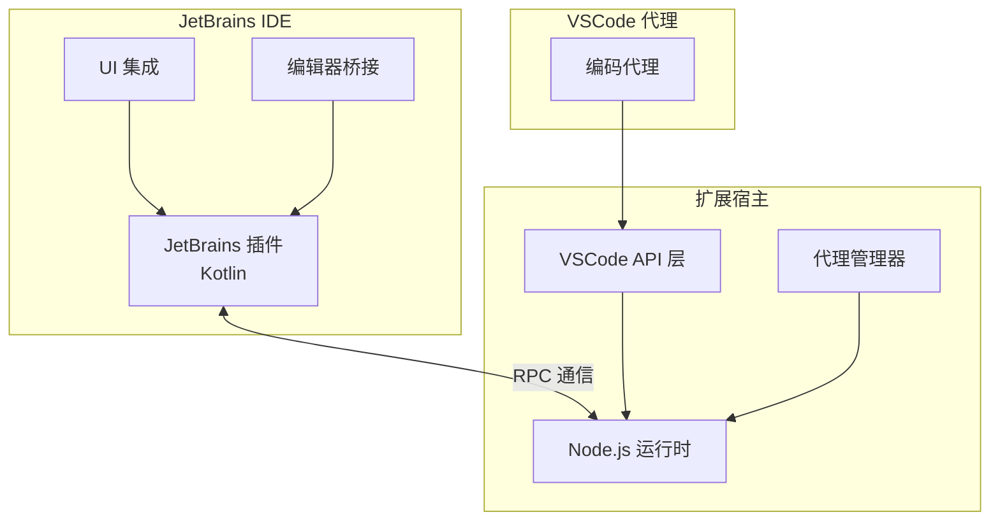

# RunVSAgent

[English](README.md) | 简体中文

[](https://opensource.org/licenses/Apache-2.0)
[](https://nodejs.org/)
[](https://www.jetbrains.com/)

> **在其他 IDE 平台中运行基于 VSCode 的编码代理**

RunVSAgent 是一个创新的跨平台开发工具，使开发者能够在 JetBrains IDEs（IntelliJ IDEA、WebStorm、PyCharm 等）或其他 IDE 平台中运行基于 VSCode 的编码代理和扩展。

## 📸 截图


## 🚀 核心功能

- **VSCode 代理兼容性**：在 JetBrains IDEs 中无缝运行基于 VSCode 的编码代理
- **跨 IDE 开发**：在不同 IDE 平台上提供统一的代理体验

## 🤖 支持的代理

- **[Roo Code](https://roocode.com)**：具有智能代码生成和重构功能的高级 AI 驱动编码助手
- **[Cline](https://cline.bot)**: 一个就在你 IDE 里的自主编码代理，在你的许可下，能够创建/编辑文件、执行命令、使用浏览器等更多功能，并在每一步都征求你的确认。

## 🔧 支持的 IDE

### JetBrains IDEs
RunVSAgent 目前支持以下 JetBrains IDE 系列：

- **IntelliJ IDEA**（旗舰版和社区版）
- **WebStorm** - JavaScript 和 TypeScript 开发
- **PyCharm**（专业版和社区版）- Python 开发
- **PhpStorm** - PHP 开发
- **RubyMine** - Ruby 开发
- **CLion** - C/C++ 开发
- **GoLand** - Go 开发
- **DataGrip** - 数据库开发
- **Rider** - .NET 开发
- **Android Studio** - Android 开发

> **注意**：为了获得最佳兼容性，需要 JetBrains IDE 版本 2023.1 或更高版本。


## 🏗️ 架构



**架构组件**：
- **JetBrains 插件**：基于 Kotlin 的 IDE 插件，用于 JetBrains IDE 集成
- **扩展宿主**：提供 VSCode API 兼容层的 Node.js 运行时环境
- **RPC 通信**：用于实时数据交换的高性能进程间通信
- **VSCode 代理**：为 VSCode 平台开发的各种编码代理和扩展

## 📦 安装

### [从 JetBrains Marketplace 下载](https://plugins.jetbrains.com/plugin/28068-runvsagent)（推荐）

**推荐方式**：我们建议优先从 JetBrains Marketplace 下载和安装插件，这是最便捷和安全的安装方式。

1. **在线安装**：
   - 打开您的 JetBrains IDE（IntelliJ IDEA、WebStorm、PyCharm 等）
   - 转到 `设置/首选项` → `插件`
   - 在 `Marketplace` 标签页中搜索 "RunVSAgent"
   - 点击 `安装` 按钮
   - 在提示时重启您的 IDE

2. **验证安装**：重启后，您应该在 IDE 的插件列表中看到 RunVSAgent 插件

### 从 GitHub Releases 下载

您可以从我们的 GitHub releases 页面下载预构建的插件：

1. **下载插件**：访问 [GitHub Releases](https://github.com/wecode-ai/RunVSAgent/releases) 页面并下载最新的插件文件（`.zip` 格式）

2. **在 JetBrains IDE 中安装**：
   - 打开您的 JetBrains IDE（IntelliJ IDEA、WebStorm、PyCharm 等）
   - 转到 `设置/首选项` → `插件`
   - 点击齿轮图标 ⚙️ 并选择 `从磁盘安装插件...`
   - 选择下载的 `.zip` 文件
   - 在提示时重启您的 IDE

3. **验证安装**：重启后，您应该在 IDE 的插件列表中看到 RunVSAgent 插件

### 从源码构建

#### 前置条件
- Node.js 18.0+
- JetBrains IDE 2023.1+
- Git
- JDK 17+

#### 构建步骤

```bash
# 1. 克隆仓库
git clone https://github.com/your-org/RunVSAgent.git
cd RunVSAgent

# 2. 设置开发环境
./scripts/setup.sh

# 3. 构建项目
./scripts/build.sh

# 4. 安装插件
# 插件文件位于：jetbrains_plugin/build/distributions/
# 在 IDE 中：设置 → 插件 → 从磁盘安装插件
```

#### 开发模式

```bash
# 以开发模式启动扩展宿主
cd extension_host
npm install
npm run dev

# 以开发模式运行 JetBrains 插件
cd jetbrains_plugin
./gradlew runIde
```

## 👥 开发者信息

### 项目结构

```
RunVSAgent/
├── extension_host/          # Node.js 扩展宿主
│   ├── src/                # TypeScript 源代码
│   │   ├── main.ts         # 主入口点
│   │   ├── extensionManager.ts  # 扩展生命周期管理
│   │   ├── rpcManager.ts   # RPC 通信层
│   │   └── webViewManager.ts    # WebView 支持
│   └── package.json        # Node.js 依赖
├── jetbrains_plugin/       # JetBrains 插件
│   ├── src/main/kotlin/    # Kotlin 源代码
│   │   └── com/sina/weibo/agent/
│   │       ├── core/       # 核心插件功能
│   │       ├── actions/    # IDE 操作和命令
│   │       ├── editor/     # 编辑器集成
│   │       └── webview/    # WebView 支持
│   └── build.gradle.kts    # Gradle 构建配置
└── scripts/                # 构建和实用脚本
```

### 技术栈

- **扩展宿主**：Node.js 18+、TypeScript 5.0+
- **JetBrains 插件**：Kotlin 1.8+、IntelliJ Platform 2023.1+
- **通信**：基于 Unix Domain Sockets/Named Pipes 的 RPC
- **构建工具**：npm/pnpm、Gradle、Shell 脚本

### 已知问题

有关已知问题和常见问题的列表，请参见[已知问题](docs/KNOWN_ISSUES.md)。

### 贡献

1. Fork 仓库
2. 创建功能分支：`git checkout -b feature/your-feature`
3. 进行更改并添加测试
4. 运行测试：`./scripts/test.sh`
5. 提交 pull request

## 👥 贡献者

我们感谢所有帮助改进此项目的贡献者：

### 🌟 核心贡献者
- **[Naituw](https://github.com/Naituw)** - *项目架构师*
- [wayu002](https://github.com/wayu002)
- [joker535](https://github.com/joker535)
- [andrewzq777](https://github.com/andrewzq777)
- [debugmm](https://github.com/debugmm)
- [Micro66](https://github.com/Micro66)
- [qdaxb](https://github.com/qdaxb)

### 🚀 贡献者

- [junbaor](https://github.com/junbaor)
- [aheizi](https://github.com/aheizi)

### 许可证

本项目基于 Apache License 2.0 许可证。详情请参见 [LICENSE](LICENSE)。

### 维护者

- **组织**：WeCode-AI 团队，微博公司
- **联系方式**：[GitHub Issues](https://github.com/wecode-ai/RunVSAgent/issues)
- **网站**：[https://weibo.com](https://weibo.com)

---

## Star History

[](https://www.star-history.com/#wecode-ai/RunVSAgent&Date)
**由 WeCode-AI 团队用 ❤️ 制作**