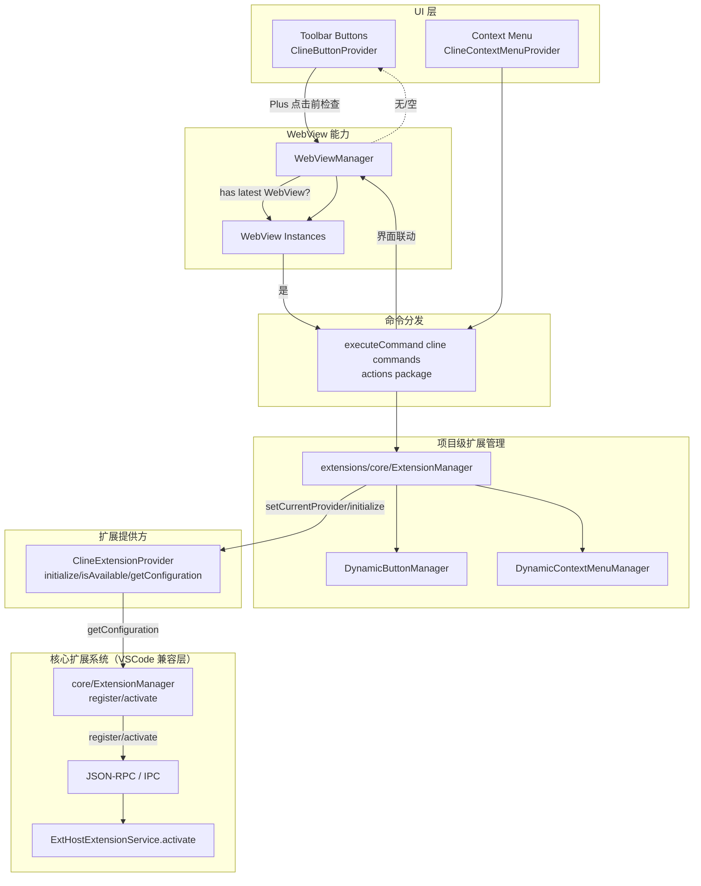

## 一、整体架构概览

- **扩展提供方接口层**: 以 `ExtensionProvider` 为统一契约，Cline 通过 `ClineExtensionProvider` 实现扩展的“可用性、初始化、元数据获取、释放”。
- **全局扩展管理层**: `extensions/core/ExtensionManager` 作为项目级全局服务，负责注册/选择/切换扩展提供方，协调 UI（按钮/上下文菜单）与配置更新。
- **UI 动态适配层**: 通过 `DynamicButtonManager` 与 `DynamicContextMenuManager` 按当前扩展提供方生成对应按钮/菜单，Cline 通过 `ClineButtonProvider` 与 `ClineContextMenuProvider` 定义本扩展的 UI。
- **命令/事件与宿主交互层**: 各 UI 入口触发 `executeCommand("cline.xxx", ...)` 与宿主交互；核心动作（如新建任务）通过命令分发落到后端逻辑。
- **WebView 能力层**: 需要 WebView 承载前端界面；当前仅“新建任务(Plus)”按钮在执行命令前对 `WebViewManager` 做可用性检查，历史/账号/设置/MCP 依赖后端命令处理与 UI 更新。

---

### 架构图（Mermaid）



---

## 二、接入摘要与代码定位

先读这段：接入 Cline 你需要“最少”实现/确认这些类与职责。

- 必须实现（插件侧三件套）：
  - `ClineExtensionProvider`：扩展的标识/描述、初始化与资源释放、可用性检查；并通过 `getConfiguration(project)` 向核心层提供元数据。
  - `ClineButtonProvider`：定义工具栏按钮集合（Plus/History/Account/Settings/MCP），在点击时派发 `cline.*` 命令；Plus 按钮执行前会检查 WebView 可用性。
  - `ClineContextMenuProvider`：声明上下文菜单的可见性策略，并按需返回具体 `AnAction` 列表（当前实现占位，可后续补齐）。

- 无需新实现但需确认已对接：
  - `extensions/core/ExtensionManager`：项目级服务，负责注册 Provider、切换扩展、刷新按钮/菜单、更新配置与广播事件（已内置包含 Cline）。
  - 命令注册中心 `com.sina.weibo.agent.actions`：确保已注册 `cline.*` 命令并与前端 WebView 对齐。
  - 扩展前端文件：`codeDir` 下的 `package.json` 与主入口 `main` 可在用户目录或插件内置资源中提供，满足 `isAvailable` 检查。

- Cline 相关类：
  - `jetbrains_plugin/src/main/kotlin/com/sina/weibo/agent/extensions/plugin/cline/ClineExtensionProvider.kt`
  - `jetbrains_plugin/src/main/kotlin/com/sina/weibo/agent/extensions/plugin/cline/ClineButtonProvider.kt`
  - `jetbrains_plugin/src/main/kotlin/com/sina/weibo/agent/extensions/plugin/cline/ClineContextMenuProvider.kt`
- 全局扩展管理：
  - `jetbrains_plugin/src/main/kotlin/com/sina/weibo/agent/extensions/core/ExtensionManager.kt`（项目级管理）
- 核心（VSCode 兼容层）的扩展注册/激活（如需理解深层激活链路）：
  - `jetbrains_plugin/src/main/kotlin/com/sina/weibo/agent/core/ExtensionManager.kt`（解析 `package.json`，注册与激活）

---

## 三、关键类与职责

- **`ClineExtensionProvider`**
  - 标识/元数据：`getExtensionId()="cline"`，`getDisplayName()`，`getDescription()`
  - 生命周期：`initialize(project)` 做扩展配置与工厂初始化；`dispose()` 释放资源
  - 可用性：`isAvailable(project)` 通过扩展文件路径或插件内置资源判断
  - 元数据桥接：`getConfiguration(project)` 将 `ExtensionConfiguration.getConfig(ExtensionType.CLINE)` 封装为 `ExtensionMetadata`，供核心层注册/激活使用。

```1:30:jetbrains_plugin/src/main/kotlin/com/sina/weibo/agent/extensions/plugin/cline/ClineExtensionProvider.kt
class ClineExtensionProvider : ExtensionProvider {
    
    override fun getExtensionId(): String = "cline"
    
    override fun getDisplayName(): String = "Cline AI"
    
    override fun getDescription(): String = "AI-powered coding assistant with advanced features"
    
    override fun initialize(project: Project) {
        // Initialize cline extension configuration
        val extensionConfig = ExtensionConfiguration.getInstance(project)
        extensionConfig.initialize()
        
        // Initialize extension manager factory if needed
        try {
            val extensionManagerFactory = ExtensionManagerFactory.getInstance(project)
            extensionManagerFactory.initialize()
        } catch (e: Exception) {
            // If ExtensionManagerFactory is not available, continue without it
            // This allows cline to work independently
        }
    }
}
```

- **`ClineButtonProvider`**
  - 定义 Cline 的工具栏按钮集合：新建任务、MCP、历史、账号、设置
  - 每个按钮点击派发对应命令（如 `cline.plusButtonClicked`），“新建任务”点击前对 WebView 可用性做检查

```59:76:jetbrains_plugin/src/main/kotlin/com/sina/weibo/agent/extensions/plugin/cline/ClineButtonProvider.kt
override fun actionPerformed(e: AnActionEvent) {
    val logger = Logger.getInstance(this::class.java)
    logger.info("🔍 Cline Plus button clicked, command: cline.plusButtonClicked")
    logger.info("🔍 Project: ${e.project?.name}")
    
    // Check WebView status before executing command
    val project = e.project
    if (project != null) {
        try {
            val webViewManager = project.getService(WebViewManager::class.java)
            if (webViewManager != null) {
                val latestWebView = webViewManager.getLatestWebView()

                if (latestWebView != null) {
                    logger.info("✅ WebView instances available, executing command...")
                    executeCommand("cline.plusButtonClicked", project, hasArgs = false)
                    logger.info("✅ Command executed successfully")
                } else {
                    logger.warn("⚠️ No WebView instances available")
                    Messages.showWarningDialog(
                        project,
                        "No active WebView found. Please ensure the Cline extension is properly initialized.",
                        "WebView Not Available"
                    )
                }
```

- **`ClineContextMenuProvider`**
  - 提供上下文菜单项可见性策略，当前实现暴露 Explain/Fix/Improve/AddToContext/NewTask 五类动作

```44:52:jetbrains_plugin/src/main/kotlin/com/sina/weibo/agent/extensions/plugin/cline/ClineContextMenuProvider.kt
override fun isActionVisible(actionType: ContextMenuActionType): Boolean {
    return when (actionType) {
        ContextMenuActionType.EXPLAIN_CODE,
        ContextMenuActionType.FIX_CODE,
        ContextMenuActionType.IMPROVE_CODE,
        ContextMenuActionType.ADD_TO_CONTEXT,
        ContextMenuActionType.NEW_TASK -> true
        ContextMenuActionType.FIX_LOGIC -> false // Cline doesn't have separate logic fix
    }
}
```

- **项目级 `extensions/core/ExtensionManager`**
  - 负责注册所有 Provider、设置当前 Provider、切换扩展、驱动按钮/菜单的动态配置与配置持久化

```116:126:jetbrains_plugin/src/main/kotlin/com/sina/weibo/agent/extensions/core/ExtensionManager.kt
private fun registerExtensionProviders() {
    getAllExtensions().forEach { registerExtensionProvider(it) }
}

fun registerExtensionProvider(provider: ExtensionProvider) {
    extensionProviders[provider.getExtensionId()] = provider
    LOG.info("Registered extension provider: ${provider.getExtensionId()}")
}
```

---

## 四、生命周期与初始化流程

1. 插件启动，项目级 `ExtensionManager.initialize(configuredExtensionId?)` 执行：
   - 注册所有 Provider（含 Cline）
   - 若用户配置了某一扩展且可用，则设为当前 Provider；否则不设默认
2. UI 层根据当前 Provider 刷新按钮/菜单（按钮通过 `DynamicButtonManager`，菜单通过 `DynamicContextMenuManager`）
3. 调用 `initializeCurrentProvider()` 时，会转调 `ClineExtensionProvider.initialize(project)` 完成扩展配置初始化
4. 用户触发 UI 动作 → 执行命令 → 宿主/前端（WebView）联动

说明：当前初始化流程在“无配置指定”时不会自动选择默认 Provider；`setDefaultExtensionProvider()` 保留为可选策略且默认未启用。

---

## 五、可用性检测与扩展文件布局

- `ClineExtensionProvider.isAvailable(project)` 依次检查：
  - 项目/用户空间扩展目录：`${VsixManager.getBaseDirectory()}/${config.codeDir}`
  - 插件内置资源目录：`PluginResourceUtil.getResourcePath(PLUGIN_ID, config.codeDir)`

```45:75:jetbrains_plugin/src/main/kotlin/com/sina/weibo/agent/extensions/plugin/cline/ClineExtensionProvider.kt
override fun isAvailable(project: Project): Boolean {
    // Check if roo-code extension files exist
    val extensionConfig = ExtensionConfiguration.getInstance(project)
    val config = extensionConfig.getConfig(ExtensionType.CLINE)

    // First check project paths
    val possiblePaths = listOf(
        "${getBaseDirectory()}/${config.codeDir}"
    )

    if (possiblePaths.any { File(it).exists() }) {
        return true
    }

    // Then check plugin resources (for built-in extensions)
    try {
        val pluginResourcePath = PluginResourceUtil.getResourcePath(
            PluginConstants.PLUGIN_ID,
            config.codeDir
        )
        if (pluginResourcePath != null && File(pluginResourcePath).exists()) {
            return true
        }
    } catch (e: Exception) {
        // Ignore exceptions when checking plugin resources
    }

    // For development/testing, always return true if we can't find the files
    // This allows the extension to work even without the actual extension files
    return false
}
```

说明：上述代码中的注释与返回值存在不一致。当前实现“未找到文件则严格返回 false”。如需开发期放宽，可临时返回 `true`，但不建议在验收/发布中保留该策略。

- 关键元数据来自 `ExtensionConfiguration.getConfig(ExtensionType.CLINE)`，包含：
  - `codeDir`（扩展代码目录）
  - `publisher`、`version`、`mainFile`、`activationEvents`、`engines`、`capabilities`、`extensionDependencies`

---

## 六、UI 接入（按钮与上下文菜单）

- 按钮集合由 `ClineButtonProvider.getButtons(project)` 返回：
  - 新建任务(Plus) → `cline.plusButtonClicked`
  - MCP → `cline.mcpButtonClicked`
  - 历史 → `cline.historyButtonClicked`
  - 账号 → `cline.accountButtonClicked`
  - 设置 → `cline.settingsButtonClicked`
- 显示策略由 `ClineButtonConfiguration` 控制（本实现展示 Plus/Prompts/History/Settings，隐藏 MCP/Marketplace）

```177:186:jetbrains_plugin/src/main/kotlin/com/sina/weibo/agent/extensions/plugin/cline/ClineButtonProvider.kt
private class ClineButtonConfiguration : ButtonConfiguration {
    override fun isButtonVisible(buttonType: ButtonType): Boolean {
        return when (buttonType) {
            ButtonType.PLUS,
            ButtonType.PROMPTS,
            ButtonType.HISTORY,
            ButtonType.SETTINGS -> true
            ButtonType.MCP,
            ButtonType.MARKETPLACE -> false
        }
    }
}
```

补充：`getButtons(...)` 返回的集合包含 MCP 按钮，但是否展示由 `ClineButtonConfiguration` 二次裁决，默认隐藏 MCP/Marketplace。

- 上下文菜单由 `ClineContextMenuProvider` 提供可见性策略，当前未返回具体 `AnAction` 列表（占位），但通过配置对哪些动作“可见/展示”进行控制。

---

## 七、命令与事件流转

- 核心命令（与宿主交互的“消息”通道）：
  - `cline.plusButtonClicked`
  - `cline.mcpButtonClicked`
  - `cline.historyButtonClicked`
  - `cline.accountButtonClicked`
  - `cline.settingsButtonClicked`
- 在“新建任务”按钮中，执行命令前会检查 `WebViewManager.getLatestWebView()` 是否存在；否则弹出友好提示，避免用户进入空白界面或执行无效命令。
 - 在“新建任务”按钮中，执行命令前会检查 `WebViewManager.getLatestWebView()` 是否存在；否则弹出友好提示，避免用户进入空白界面或执行无效命令。
 
命令注册/分发入口位于 `com.sina.weibo.agent.actions` 包，`ClineButtonProvider` 通过 `executeCommand("cline.xxx", ...)` 触发执行。

---

## 八、WebView 交互要点

- 通过 `project.getService(WebViewManager::class.java)` 获取 WebView 管理器。
- 推荐在任何需要依赖前端界面渲染的动作前，检查 WebView 是否可用。
- 如不可用，给予用户警告提示，并指导初始化（如先打开面板/登录等）。
 - 当 `WebViewManager` 实例不可用时当前实现仅记录告警日志（不弹窗）；当存在管理器但无任何 WebView 实例时，会弹出“WebView Not Available”警告。

---

## 九、扩展切换与配置更新

- 通过项目级 `extensions/core/ExtensionManager.setCurrentProvider(extensionId, forceRestart?)` 切换当前扩展提供方：
  - 会调用新 Provider 的 `initialize(project)`
  - 更新配置中心 `ExtensionConfigurationManager.setCurrentExtensionId(extensionId)`
  - 刷新按钮与上下文菜单的动态配置
  - 发布扩展变更事件（`ExtensionChangeListener`）
- 如需强制重启相关进程/UI，可使用 `switchExtensionProvider(extensionId, forceRestart=true)` 走完整切换流程。

```163:171:jetbrains_plugin/src/main/kotlin/com/sina/weibo/agent/extensions/core/ExtensionManager.kt
fun setCurrentProvider(extensionId: String, forceRestart: Boolean? = false): Boolean {
    val provider = extensionProviders[extensionId]
    if (provider != null && provider.isAvailable(project)) {
        val oldProvider = currentProvider
        if (forceRestart == false) {
            currentProvider = provider
        }

        // Initialize new provider (but don't restart the process)
        provider.initialize(project)
```

---

## 十、从零接入 Cline 的实操步骤

1. **实现 Provider**
   - 在 `extensions/plugin/cline/` 下实现 `ClineExtensionProvider`，确保 `getExtensionId()="cline"` 且实现 `initialize/isAvailable/getConfiguration/dispose`。
2. **注册 Provider**
   - 确保项目级 `extensions/core/ExtensionManager.getAllExtensions()` 返回包含 Cline：
     - 已内置 `add(ClineExtensionProvider())`。
3. **UI 接入**
   - 在 `ClineButtonProvider` 中定义按钮集合与各自命令；必要时在动作执行前检查 WebView。
   - 在 `ClineContextMenuProvider` 中声明上下文菜单可见性策略，按需补充 `getContextMenuActions`。
4. **命令派发与宿主关联**
   - 保证后端对 `cline.*` 命令有处理逻辑（通常在命令分发中心/消息总线中注册），前端 WebView 能接收并渲染。
5. **扩展文件准备**
   - 在 `${VsixManager.getBaseDirectory()}/${config.codeDir}` 准备扩展文件（含 `package.json` 与主入口 `main`），或将其作为插件内置资源。
6. **配置与元数据**
   - 确认 `ExtensionConfiguration.getConfig(ExtensionType.CLINE)` 中的 `codeDir/publisher/version/mainFile/activationEvents/engines/capabilities/extensionDependencies` 与实际一致。
7. **初始化与切换**
   - 启动项目后，调用全局 `ExtensionManager.initialize()`，必要时调用 `setCurrentProvider("cline")` 切换。
8. **自测试**
   - 点击工具栏按钮与上下文菜单，确认命令派发、WebView 正常、日志输出合理。

---

## 十一、调试与日志

- 所有关键流程均有 `Logger` 记录：
  - 按钮点击、WebView 可用性、命令执行成功/失败，都有明确日志前缀（含 ✅/⚠️/❌）。
- 建议在 IDE 的 “Event Log” 与 “Run/Debug Console” 中观察：
  - 验证 `isAvailable` 的路径判断是否命中
  - 验证 `initialize` 是否被调用
  - 验证命令是否派发与处理

---

## 十二、常见问题与建议

- **按钮点击无效果**: 多数是 WebView 未初始化。确认已打开对应面板或有可用 WebView；Cline 的“新建任务”已做了可用性检查与用户提示。
- **`isAvailable=false`**: 检查 `config.codeDir` 与 `VsixManager.getBaseDirectory()` 的组合路径是否存在，或插件资源路径是否正确；开发阶段不建议强行返回 `true`，以免掩盖部署问题。
- **切换后 UI 未更新**: 确保走了 `setCurrentProvider(..., forceRestart=false)` 流程，按钮/菜单的动态管理器会在此处刷新。
- **命令未被处理**: 确保后端命令分发处已注册 `cline.*` 对应处理器；前端 WebView 也要监听并响应。

---

## 十三、扩展与自定义建议

- 在 `ClineContextMenuProvider.getContextMenuActions(project)` 中返回具体 `AnAction`，将 Cline 的上下文动作用命令联通，形成更一致的 UX。
- 在 `ClineButtonConfiguration` 中根据许可/账号状态动态控制按钮可见性。
- 在 `ClineExtensionProvider.initialize` 中按需拉取远端配置或做鉴权初始化，并做好异常容错。

---

## 十四、与“核心扩展系统”的衔接（可选深入）

如需与下层 VSCode 兼容层打通（解析/注册/激活 `package.json`）：

- 使用核心层的 `com.sina.weibo.agent.core.ExtensionManager` 完成：
  - 解析扩展 `package.json`
  - 通过 `registerExtension(path, config)` 注册
  - 调用 `activateExtension(extensionId, rpcProtocol)` 激活
- 该层将通过 JSON-RPC/IPC 调用宿主 `ExtHostExtensionService.activate(...)`，返回 `LazyPromise`，最终转为 `CompletableFuture<Boolean>`。

```171:205:jetbrains_plugin/src/main/kotlin/com/sina/weibo/agent/core/ExtensionManager.kt
fun activateExtension(extensionId: String, rpcProtocol: IRPCProtocol): CompletableFuture<Boolean> {
    LOG.info("Activating extension: $extensionId")
    
    try {
        // Get extension description
        val extension = extensions[extensionId]
        if (extension == null) {
            LOG.error("Extension not found: $extensionId")
            val future = CompletableFuture<Boolean>()
            future.completeExceptionally(IllegalArgumentException("Extension not found: $extensionId"))
            return future
        }

        // Create activation parameters
        val activationParams = mapOf(
            "startup" to true,
            "extensionId" to extension.identifier,
            "activationEvent" to "api"
        )

        // Get proxy of ExtHostExtensionServiceShape type
        val extHostService = rpcProtocol.getProxy(ServiceProxyRegistry.ExtHostContext.ExtHostExtensionService)
        
        try {
            // Get LazyPromise instance and convert it to CompletableFuture<Boolean>
            val lazyPromise = extHostService.activate(extension.identifier.value, activationParams)
            
            return lazyPromise.toCompletableFuture<Any?>().thenApply { result ->
                val boolResult = when (result) {
                    is Boolean -> result
                    else -> false
                }
                LOG.info("Extension activation ${if (boolResult) "successful" else "failed"}: $extensionId")
                boolResult
            }.exceptionally { throwable ->
                LOG.error("Failed to activate extension: $extensionId", throwable)
                false
            }
```

---

## 十五、验收清单（接入完成自查）

- **Provider**: `ClineExtensionProvider` 存在且被全局管理器注册；`isAvailable` 能正确判断
- **UI**: 工具栏按钮可见且可用，上下文菜单策略正确
- **命令**: `cline.*` 命令均能派发并被处理
- **WebView**: 可用性检查与用户提示生效
- **配置**: `ExtensionConfiguration(ExtensionType.CLINE)` 与实际扩展文件一致